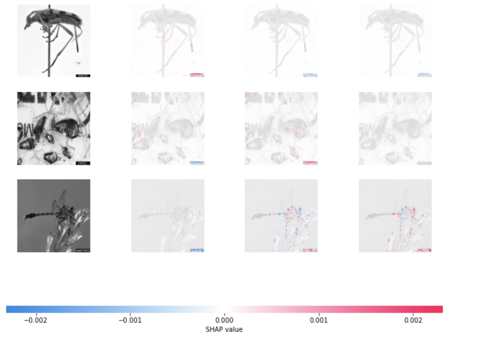

## Background
Convolutional Neural Network has made ground-breaking achivements in the Computer Domain. Nowadays, it has been widely on different deep learning tasks including object classification, search engines, and face recognition. However, given its complex architecture and high abstraction level, CNN models have remained relatively un-explainable and are bestowed the name of "black box model." 
Researchers have been trying to find frameworks and tools that can help debunk the myths of CNN and make it more interpretable. [SHAP](https://github.com/slundberg/shap) is one of the most robust and easy-to-use tools that visualize and make sense of the model prediction. In this analysis, we are going to use a Tensorflow CNN model on insect images to create a classification model that distinguishes beetles, cockroaches, and dragonflies. Then we are going to use SHAP to interprete the model and understand how does the model made predictions.
## Data
For this task, we are going to train our model on 1019 photos that is balanced across three different insects: beetles, cockroaches, and dragonflies. After training, we are going to examine model performance on 180 photos also balanced across the three different classes. 
When creating the data, therea are 4 pre-processing steps:
- convert photo folder index into numerical label
- read in images in grey scale
- standardize each pixel value by 255
- scale each picture to be 200 x 200 dimension. 

```python
{
for category in categories:
    # path to folder that contains the picture
    path = os.path.join(train_directory, category)
    for img in os.listdir(path):  # Iterate over every image
        img_array = cv2.imread(os.path.join(path,img) ,cv2.IMREAD_GRAYSCALE) # Convert to array
        label = categories.index(category) # Give label: beetles=0, cockroach=1, dragonflies = 2
        resized_img = cv2.resize(img_array, (imag_size, imag_size))
        standardized = np.divide(resized_img, standardize)
        training_data.append([(standardized), label])
}
```
## Model
In this analysis, we built a CNN model using Tensorflow Keras that has two convolutional layers, one max pooling layer, and two fully-connected layers. Essentially, this model takes in 200 x 200 x 1 matrix, and sequentially applies layers on the input and use a softmax function to assign a probability of the photo belonging to each class. 
```python
{
shape = (200,200,1)

model = Sequential()
model.add(Conv2D(32, kernel_size=(3, 3),
                 activation='relu',
                 input_shape=shape))
model.add(Conv2D(64, (3, 3), activation='relu'))
model.add(MaxPooling2D(pool_size=(2, 2)))
model.add(Flatten())
model.add(Dense(128, activation='relu'))
model.add(Dense(num_classes, activation='softmax'))
}
```
This relatively simple architecture after 3 epochs of training is able to give satisfactory predictions. The evaluation results show that the model has accuracy, precision, recall all close to 0.98, with F1 score of 0.978.

## SHAP Interpretation
Now we are able to see all the trained parameters, prediction results, and different types of evaluation metrics. But how did the model reach the decision that it made? What are the criteria for predicting a picture as bettles instead of dragon flies? 

What SHAP algorithm does is to use a game theoretic approach to explain the output of any machine learning model. Specifically, red pixels represent positive SHAP values that increase the probability of the class, while blue pixels represent negative SHAP values the reduce the probability of the class. 
In this case, we see that the the upper left graph maps to the positive SHAP values for assigning this graph to class 0, which is beetles. It seems that it captures the the lower tail of the beetle as key defining features. 